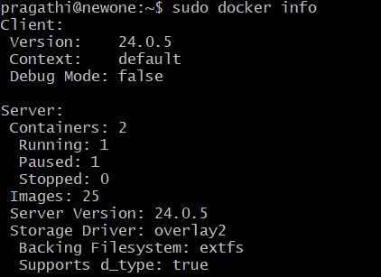

connects to a running container terminal.

builds dockerimage using docker builder.

removes builder cache.

creates new builder instance. 

displays disk usage of the created instance. 

inspect the contents of an image in a registry.

inspect the configuration of a builder instance.

lists the available builder instances.

stops a builder instance.

sets the current builder instance.

shows the current version of buildx downloaded in the vm.

lists the checkpoints for a container. 

create a configuration object from a file.

display detailed information about a configuration file.

shows the list of created configuration file.

creates a new image from a container's changes.

creates a empty container.

used to inspect changes to files or directories on a container's filesystem.

starts an interactive shell inside the running container.

exports a container's file system as a tar file.

shows detailed information about one or more docker containers.

used to forcefully stop a running docker container. 

used to remove all stopped containers. It helps to clean up the system by deleting containers that are no longer running.

used to rename an existing container.

used to build a Docker image from a Dockerfile.

used to manage docker swarm configuration data. 

pausing a container will freeze its processes, while unpause will resume their execution.

lists all the running containers.

used to restart one or more stopped or running containers.

used to fetch the logs generated by a running or stopped container in docker.

used to create and start a container based on a docker image.

used to start one or more stopped containers.

provides real-time information about CPU, memory, network, and disk I/O usage.

used to display the running processes inside a specified docker container.

allows you to modify various settings for a running container without stopping it.

used to block until a container stops, then prints the container's exit code.

used to clean up unused buildx-related resources.

used to remove a docker swarm configuration file.

lists the running containers.

lists all the created images.

used to display the version information for Docker Compose.

create a new docker compose YAML file.

start docker compose in detached mode.

used to stop and remove the containers, networks, and volumes defined in your docker compose configuration.

used to list the containers associated with a Docker Compose.

shows a list of images used by the services defined in the docker-compose.yml file.

used to stop services defined in a docker compose.

used to start services that were previously stopped using the docker-compose stop command.

used to display detailed information about one or more docker networks.

used to remove one or more docker networks.

(network create)is used to create a new docker network,(network ls)is used to list all the Docker networks on the host.

used to remove one or more created docker volumes.

used to remove all unused docker volumes i.e, those that are not associated with running or stopped containers.

used to display detailed information about one or more docker volumes.

lists all the created volumes.

used to create a volume for sharing files between host and the container.

provides detailed information about the docker daemon and its configuration.
